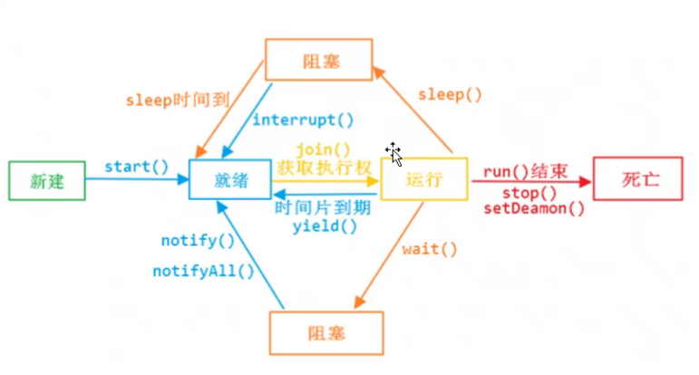

# 第二期笔记

## JAVA 并发编程

### 第一课：线程基础、线程之间的共享和协作

#### 什么是进程和线程

    进程：操作系统进行资源分配的最小单位
    线程：CPU调度的最小单位，不能够独立于进程存在，必须依赖进程

#### CPU核心数和线程数的关系

#### CPU时间片轮转机制

    RR调度，时间片轮转调度
    
#### 澄清并行和并发

    并行：parallel，并行表示可以同时进行处理的数量
    并发：concurrent，与时间段有关，并发实际上是交替执行
    
#### 高并发变成的意义、好处和注意事项

    充分利用资源，加快反应速度
    可以使代码模块化、异步化、简单化
    
    注意事项：
    1、线程安全
    2、
    3、OS限制：
        Linux 一个进程最多能开1k个线程，能打开1024个句柄
        WIndows最多可开2k个线程
        
#### 认识Java里的线程

    Java 程序天生就是多线程的
        通过类Thread
        通过接口 Runnable
        
    Thread 和 Runnable 的区别：手写代码Thread 和 Runnable 的区别
        Java 对线程的抽象：Thread
        Runnable：对任务和业务逻辑的抽象
        
#### 有开始就有结束，怎么样才能让Java里的线程安全停止工作：

    stop()
    interrupt()
    isInterrupted()
    interrupted() static 方法
    
    JDK里的线程是协作式的，而不是抢占式
    
    手写代码，区别interrupt()、isInterrupted()和静态类的interrupted()方法。区别中断 Thread 和 Runnable 的方式
    手写代码，尝试捕获 InterruptException 后 interrupt 标志位的状态
    
    注意：处于死锁状态的线程是不会处理 InterruptException 的
    
#### 线程常用方法和线程的状态

    深入理解 run() 和 start()
    sleep()
    了解 yield()：将线程从运行转到可运行状态
    join()：可以保证两个线程顺序的执行
    线程优先级：默认值为5，优先级高低，完全由OS决定，不一定会起到作用
    守护线程：setDeamon(true)，会随着主线程一起消亡，其中的 finally 方法不一定会执行

#### 什么是线程间的共享

    synchronized 内置锁
        用处和用法
            同步代码块
            方法
        对象锁，synchronized用在方法、代码块的时候，锁住的是当前对象
        类锁：synchronized用在静态方法时，锁住的是当前类的class对象。类锁和对象锁可以完全并行运行，互不干扰。
    volatile 关键字，最轻量的同步机制，之恩那个保证共享变量之间的可见性，但不能保证其原子性
        常用在一个线程写，多个线程读的场景
    
    错误的加锁和原因分析
    
#### ThreadLocal 辨析

    ThreadLocal 的使用
    
    实现解析
    
    引发内存泄漏分析

        强引用：Object object = new Object(); // 所有的 new 对象都是强引用，栈里有引用指向堆内的对象，则一直不会释放
        软引用：SoftReference // GC时如果内存足够，则不会回收，但如果内存不够则回收
        弱引用：WeakRefernece // 只要发生了垃圾回收，弱引用所指向堆内的实例都会被回收
        虚引用：
        
    ThreadLocal 线程不安全
    
#### 线程间的协作

    wait()
    notify/notifyAll

等待和通知的标准范式
等待：
sync(对象){
    while(条件不满足){
        对象.wait()
    }
    // 业务逻辑
}
通知：
syn(对象){
    // 业务逻辑，改变条件
    对象.notify/notifyAll();
}

    notify和notifyAll应该用谁？尽量用notifyAll来通知所有等待的线程

    等待超时模式实现一个连接池
    
    调用yield()、sleep()、wait()、notify()等方法对锁有何影响？
        yield(): 让出时间片，但不释放锁，当前线程会转到就绪状态
        sleep(): 睡眠，但不释放锁，当前线程处于阻塞状态
    yield 会让出CPU的执行权，不会释放锁（就绪）
    sleep 不会释放锁（阻塞）
    wait 会释放锁，被唤醒时去竞争锁（阻塞）
    notify/notifyAll 不释放锁，一般放在同步代码块的最后一行（阻塞）

### 第二课：线程的并发工具

#### Fork/Join体现了分而治之

    什么是分而治之？
        大问题 -> 分割成相同的小问题，小问题之间无关联
        设计思想
        策略
        
    十大计算机经典算法：快速排序、堆排序、归并排序、二分查找、线性查找、深度优先、广度优先、Dijkstra、动态规划、朴素贝叶斯分类
        快速排序、归并排序、二分查找就是使用了Fork/Join
        归并排序：对于给嘀咕的一组数据，利用递归与分治技术将数据序列化分成为越来越小的半子表，在对半子表排序后，在用递归方法将排序好的半子表合并成为越来越大的有序序列
            为了提升性能，有时我们在半子表的个数小于某个书（比如15）
            
    Fork/Join 原理
        fork/join框架：就是在必要的请跨国下，将一个大人物，进行拆分（fork)成若干个小人物(拆到不可再拆时)，再将一个个的小人物运算的结果进行join汇总
        fork/join里有工作密取方式：先完成工作的线程会从别的线程中取出还未完成的任务，做完之后再还回去
        
    Fork/Join实战
        Fork/Join的同步用法同时演示返回结果值：统计整形数组中所有元素的和
        Fork/Join的异步用法同时演示不要求返回值：遍历指定目录(含子目录)，寻找指定类型的文件
        
#### CountDownLatch的作用、应用场景和实战

    await的线程可以是多个
    countDown可以在同一个线程中扣减多次
    
    await的扣减只能扣减一次
    由外部线程来协调线程的同步
    
#### CyclicBarrier的作用、应用场景和实战

    初始化的数量必须和等待数量相同
    
    await方法可以多次使用，配合action可以看到多次执行action
    由线程本身自己来协调同步
    
    CountDownLatch 和 CyclicBarrier 的区别：
    1、CyclicBarrier 的计数器可以反复使用，在某个屏障上反复协调使用。
    2、在协调线程之间同时运行的区别：CountDownLatch 是由外部线程来做，CyclicBarrier 由线程本身自己来协调
    3、CountDownLatch 的计数器跟线程数没有关系，CyclicBarrier 则跟线程数密切相关的
    4、CountDownLatch 不能汇总线程之间的计算结果，但 CyclicBarrier 可以在传入action之后进行线程之间结果的汇总。
    
#### Semaphore的作用、应用场景和实战

    对公共资源有限的场景做流量控制，和被争夺的资源本身没有任何关系
    Semaphore注意事项：
        如果没有事先调用acquire就直接调用release的话，会一直增加数量
        
#### Exchange的作用、应用场景和实战

    两个线程之间进行数据交换，JDK保证交换的过程是线程安全的
    
#### Callable、Future、FutureTask

    FutureTask 既可以当作 Runnable 投给线程执行，也可以拿到结果
    可以中断
    
### 第三课：原子操作 CAS

#### CAS(Compare And Swap)
    
    什么是原子操作？如何实现原子操作？
    属于乐观锁
    
CAS的原理

- 利用了现代处理器都支持的CAS指令
- 循环这个指令，直到成功为止

CAS的问题

- ABA问题
- 开销问题
- 只能保证一个共享变量的原子操作

#### 原子操作类的使用

#### JDK中相关原子操作类的使用

    更新基本类型类：AtomicBoolean、AtomicInteger、AtomicLong
    更新数组类：AtomicIntegerArray、AtomicLongArray、AtomicReferenceArray
    更新引用类型：AtomicReference、AtomicMarkableReference、AtomicStampedReference
    原子更新字段类：……………………
    
### 第四课：显式锁和AQS

#### 显式锁
    
    申明一个锁，手动去释放、加锁的，叫显式锁
    Lock接口和和新方法
        lock()
        unlock()
        tryLock()
        
    Lock接口和synchronized的比较
        synchronized的消耗比显式锁少
        
    可重入锁ReentrantLock、公平锁和非公平锁
    
    Lock接口的使用范式
    
    可重入锁
    
    ReadWriteLock接口和读写锁ReentrantReadWriteLock，什么情况下用读写锁？
    
    Condition接口
    
    用Lock和Condition实现等待通知
    
    了解LockSupport工具
    作用：
        阻塞一个线程
        唤醒一个线程
        构建同步组件的基础工具
    park开头的方法：阻塞一个线程
    unpart开头的方法：唤醒一个线程
    
#### AQS(AbstractQueuedSynchronizer)

    CLH 队列锁
    什么是AQS？学习它的必要性
        AQS 使用方式和其中的设计模式
        了解其中的方法
        实现一个类似于 ReentrantLock 的锁
        
    AQS 中的数据结构 - 节点和同步队列
    
    都展示同步状态获取与释放
    
    其他同步状态获取与释放
        共享是同步状态获取与释放
        都展示超时同步状态 获取
        
    再次实战：实现一个奇葩的三元共享同步工具类
    
#### Condition 分析

    一个Condition包含一个等待队列
    
    区分同步队列与等待队列
    
    既然是3个线程共享，为什么在加锁或者释放锁的时候getState所在的for循环里没有做同步？
    
#### 回头看Lock的实现
    
    了解 ReentrantLock 的实现
        锁的可重入
        公平和非公平
        
    将类似于ReentrantLock的锁实现修正为可重入
    了解ReentrantReadWriteLock的实现
    
### 第五课：并发容器

#### 预备知识 - Hash

    Hsah，一般翻译做“散列”，也有直接音译为“哈希”的，就是把任意长度的输入（又叫做预映射）
    简单的说就是一种将任意长度的消息压缩到某一固定长度的消息摘要的函数。
    
    常用的hash函数：直接取余法、乘法取整法、平方取中法
    MD5、SHA-1：加密算法（摘要算法），不可逆
    
    开放寻址：当出现hash冲突的时候，在当前地址继续往后找
    再散列：再次散列
    链地址法：冲突的元素在当前地址后面用链表组合起来
    
#### 预备知识 - 位运算

    我们日常使用的是十进制，计算机中庸二进制
    十进制：逢十进一
    二进制：逢二进一
    
    Java位运算中一些常用运算：
        位与 & ：1&1=1 、0&0=0、1&0=0
        位或 | ：1|1=1,0|0=0， 1|0=1
        位非 ~ ：~1=0， ~0=1
        位异或 ^: 1^1=0, 1^0=1, 9^9=0
        有符号右移：>> 若正数，高位补0，负数高位补1
        有符号左移 <<
        无符号右移：>>>无论正负，高位均补0
        
    有趣的取模性质：取模 a%2(2^n)等价于 a&(n-1)，所以在map理的数组个数一定是2的乘方数，计算key值在哪个元素中的时候，就用到了位运算来快速定位。
    
    位运算的运用场景
        哪里可以用到位运算：
            Java中的类修饰符、成员变量修饰符、方法修饰符
            Java容器中的HashMap和ConcurrentHashMap的实现
            权限控制或商品属性
            简单的可逆加密(1^1=0; 0^1=1)
        实战：将位运算用在权限控制、商品属性上
            节省很多代码
            效率高
            属性变动影响小
            不直观
    
     如何快速的判定一个数是奇数还是偶数？
 
 1.7种的HashMap的死循环，会形成一个环形的数据结构