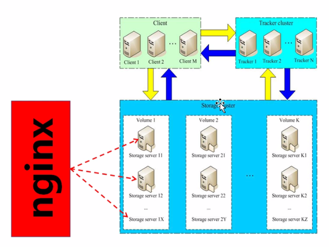

# FastDFS 进阶实战

1、简介

    FastDFS是一个开源的高性能分布式文件系统(DFS)。
    它主要的功能包括：文件存储、文件同步和文件访问，以及高容量和负载平衡。
    主要解决了海量数据存储问题，特别适合以中小文件(建议4KB < fileSize < 500MB)为载体的在线服务。
    
    FastDFS系统有三个角色：
        跟踪服务器(Tracker Server)
        存储服务器(Storage Server)
        客户端(Client)
        
    Tracker Server: 跟踪服务器，主要做调度工作，祈祷均衡的作用；负责管理所有的Storage Server和group，每个Storage在启动后会连接Tracker告知自己所属group等信息，并保持周期性心跳
    Storage Server: 存储服务器，主要提供容量和备份服务；以group为单位，每个group内可以有多台Storage Server，数据互为备份。
    Client: 客户端，上传下载数据的服务器，也就是我们自己的项目所部署在的服务器。
    

