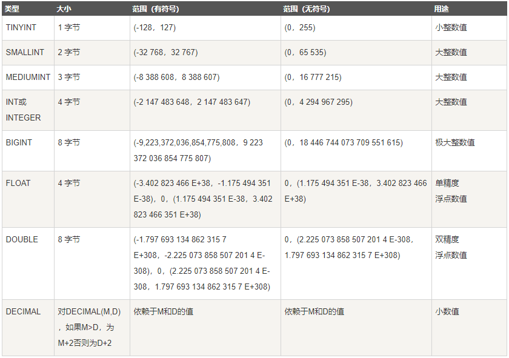
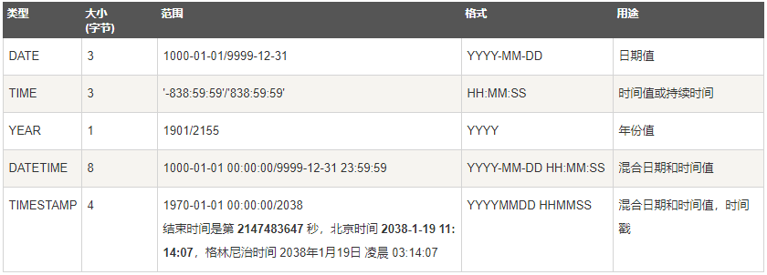
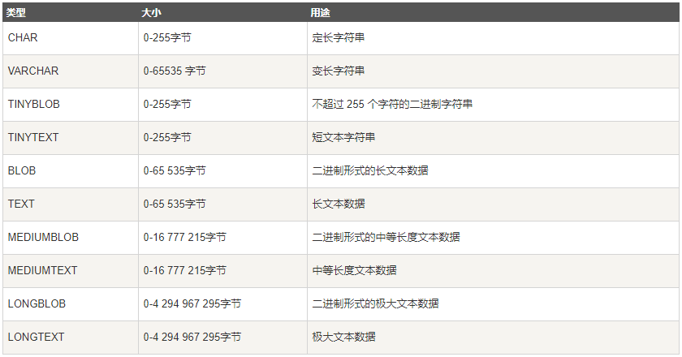

# 索引与执行计划

## 索引

### 索引是什么？

MySQL 官方的定义：索引(index)是帮助 mysql 高效获取数据的数据结构。

索引的本质是数据结构

### B+Tree

特点：

- 数据只存储在叶子节点上，非叶子节点保存索引信息
    - 非叶子节点(索引节点)存储的只是一个flag，不保存实际数据记录
    - 索引节点的左子树比其flag小，右子树大于等于flag
- 叶子节点本身按照数据的升序进行链接(串联起来)
    - 叶子节点中的数据在物理存储上是无序的，仅仅是在逻辑上有序(通过指针串在一起)
- 叶子节点是环形串联的

插入新值时会有分裂

|leaf page 满|index page 满|操作|
|:---:|:---:|:---|
|no|no|直接将记录插入到叶子节点|
|yes|no|1) 拆分leaf page<br />2) 将中间的节点放入到index page中<br />3) 小于中间节点的记录放左边<br />4) 大于或等于中间节点的记录放右边|
|yes|yes|1) 拆分leaf page<br />2) 小于中间节点的记录放左边<br />3) 大于或等于中间节点的放右边<br />4) 拆分index page<br />5) 小于中间节点的记录放左边<br />6) 大于中间节点的放右边<br />7) 中间节点放入上一层index page|

- 删除旧值时会有合并

### 索引的分类

### 基础语法

## 执行计划

## 什么是执行计划

## 执行计划的作用

- 表的读取顺序
- 数据读取操作的类型
- 哪些索引可以使用
- 那些索引被实际使用
- 表之间的引用
- 每张表有多少行被优化器查询


## 执行计划详解

执行计划包含的信息:

```text
mysql> explain select * from account;
+----+-------------+---------+------------+------+---------------+------+---------+------+------+----------+-------+
| id | select_type | table   | partitions | type | possible_keys | key  | key_len | ref  | rows | filtered | Extra |
+----+-------------+---------+------------+------+---------------+------+---------+------+------+----------+-------+
|  1 | SIMPLE      | account | NULL       | ALL  | NULL          | NULL | NULL    | NULL |    5 |   100.00 | NULL  |
+----+-------------+---------+------------+------+---------------+------+---------+------+------+----------+-------+
1 row in set, 1 warning (0.07 sec)
```

### 执行计划 - id

select 查询的序列号，包含一组数字，表示查询中执行 select 自居或操作表的顺序

有三种情况：

- id 相同，执行顺序由上至下
- id 不同，如狗是子查询，id的序号会递增，id值越大优先级越高越先被执行
- id 既有相同又有不同，先执行序号大的，同时相同的序号从上到下顺序执行

```text
// id 相同的
mysql> explain select t2.* from t1,t2,t3 where t1.id=t2.id and t1.id=t3.id and t1.other_column='';
+----+-------------+-------+------------+--------+---------------+---------+---------+------------+------+----------+-------------+
| id | select_type | table | partitions | type   | possible_keys | key     | key_len | ref        | rows | filtered | Extra       |
+----+-------------+-------+------------+--------+---------------+---------+---------+------------+------+----------+-------------+
|  1 | SIMPLE      | t1    | NULL       | ALL    | PRIMARY       | NULL    | NULL    | NULL       |    1 |   100.00 | Using where |
|  1 | SIMPLE      | t2    | NULL       | eq_ref | PRIMARY       | PRIMARY | 4       | mall.t1.id |    1 |   100.00 | Using index |
|  1 | SIMPLE      | t3    | NULL       | eq_ref | PRIMARY       | PRIMARY | 4       | mall.t1.id |    1 |   100.00 | Using index |
+----+-------------+-------+------------+--------+---------------+---------+---------+------------+------+----------+-------------+
3 rows in set, 1 warning (0.00 sec)

// id 不相同的，按 id 值倒序执行
mysql> explain
    -> select t2.* from t2 where id =(
    -> select id from t1 where id = (
    -> select t3.id from t3 where t3.other_column = ''));
+----+-------------+-------+------------+-------+---------------+---------+---------+-------+------+----------+-------------+
| id | select_type | table | partitions | type  | possible_keys | key     | key_len | ref   | rows | filtered | Extra       |
+----+-------------+-------+------------+-------+---------------+---------+---------+-------+------+----------+-------------+
|  1 | PRIMARY     | t2    | NULL       | const | PRIMARY       | PRIMARY | 4       | const |    1 |   100.00 | NULL        |
|  2 | SUBQUERY    | t1    | NULL       | const | PRIMARY       | PRIMARY | 4       | const |    1 |   100.00 | Using index |
|  3 | SUBQUERY    | t3    | NULL       | ALL   | NULL          | NULL    | NULL    | NULL  |    4 |    25.00 | Using where |
+----+-------------+-------+------------+-------+---------------+---------+---------+-------+------+----------+-------------+
3 rows in set, 1 warning (0.00 sec)

// id 既有相同又有不同，先按值大的优先执行，值相等之后从上往下执行
mysql> explain select t2.* from (select t3.id from t3 where t3.other_column = '') s1, t2 where s1.id = t2.id;
+----+-------------+-------+------------+--------+---------------+---------+---------+------------+------+----------+-------------+
| id | select_type | table | partitions | type   | possible_keys | key     | key_len | ref        | rows | filtered | Extra       |
+----+-------------+-------+------------+--------+---------------+---------+---------+------------+------+----------+-------------+
|  1 | SIMPLE      | t3    | NULL       | ALL    | PRIMARY       | NULL    | NULL    | NULL       |    4 |    25.00 | Using where |
|  1 | SIMPLE      | t2    | NULL       | eq_ref | PRIMARY       | PRIMARY | 4       | mall.t3.id |    1 |   100.00 | NULL        |
|  3 | DERIVED     | t3    | NULL       | ALL    | NULL          | NULL    | NULL    | NULL       |    1 |    25.00 | Using where |
+----+-------------+-------+------------+--------+---------------+---------+---------+------------+------+----------+-------------+
2 rows in set, 1 warning (0.00 sec)
```

### 执行计划 - select_type

select 的类型，主要用于区别普通查询、联合查询、子查询等复杂的查询

|id|select_type|description|
|:---:|:---|:---|
|1|SIMPLE|简单的 select 查询，查询中不包含子查询或者 union|
|2|PRIMARY|查询中若包含任何复杂的子部分，最外层查询则被标记为 primary|
|3|SUBQUERY|在 select 或 where 列表中包含了子查询|
|4|DERIVED|在 from 列表中包含的子查询被标记为 derived(衍生)，mysql 会递归执行这些子查询，把结果放在临时表里|
|5|UNION|若第二个 select 出现在 union 之后，则被标记为 union；若 union 包含在 from 自居的子查询中，外层 select 将被标记为 derived|
|6|UNION RESULT|从 union 表获取结果的 select|

```text
// simple
mysql> explain select * from t1;
+----+-------------+-------+------------+------+---------------+------+---------+------+------+----------+-------+
| id | select_type | table | partitions | type | possible_keys | key  | key_len | ref  | rows | filtered | Extra |
+----+-------------+-------+------------+------+---------------+------+---------+------+------+----------+-------+
|  1 | SIMPLE      | t1    | NULL       | ALL  | NULL          | NULL | NULL    | NULL |    4 |   100.00 | NULL  |
+----+-------------+-------+------------+------+---------------+------+---------+------+------+----------+-------+
1 row in set, 1 warning (0.58 sec)

// primary 和 subquery
mysql> explain select t1.*,(select t2.id from t2 where t2.id = 1) from t1;
+----+-------------+-------+------------+-------+---------------+---------+---------+-------+------+----------+-------------+
| id | select_type | table | partitions | type  | possible_keys | key     | key_len | ref   | rows | filtered | Extra       |
+----+-------------+-------+------------+-------+---------------+---------+---------+-------+------+----------+-------------+
|  1 | PRIMARY     | t1    | NULL       | ALL   | NULL          | NULL    | NULL    | NULL  |    4 |   100.00 | NULL        |
|  2 | SUBQUERY    | t2    | NULL       | const | PRIMARY       | PRIMARY | 4       | const |    1 |   100.00 | Using index |
+----+-------------+-------+------------+-------+---------------+---------+---------+-------+------+----------+-------------+
2 rows in set, 1 warning (0.33 sec)

// derived
mysql> explain
    -> select t1.* from t1, (select t2.* from t2 where t2.id = 1) s2 where t1.id = s2.id;
+----+-------------+------------+------------+--------+---------------+---------+---------+-------+------+----------+-------+
| id | select_type | table      | partitions | type   | possible_keys | key     | key_len | ref   | rows | filtered | Extra |
+----+-------------+------------+------------+--------+---------------+---------+---------+-------+------+----------+-------+
|  1 | PRIMARY     | <derived2> | NULL       | system | NULL          | NULL    | NULL    | NULL  |    1 |    25.00 | NULL  |
|  1 | PRIMARY     | t1         | NULL       | const  | PRIMARY       | PRIMARY | 4       | const |    1 |   100.00 | NULL  |
|  2 | DERIVED     | t2         | NULL       | const  | PRIMARY       | PRIMARY | 4       | const |    1 |    25.00 | NULL  |
+----+-------------+-------+------------+--------+---------------+---------+---------+------------+------+----------+-------+
2 rows in set, 1 warning (0.00 sec)

// union 和 union_result
mysql> explain
    -> select * from t2
    -> union
    -> select * from t2;
+------+--------------+------------+------------+------+---------------+------+---------+------+------+----------+-----------------+
| id   | select_type  | table      | partitions | type | possible_keys | key  | key_len | ref  | rows | filtered | Extra           |
+------+--------------+------------+------------+------+---------------+------+---------+------+------+----------+-----------------+
|  1   | PRIMARY      | t2         | NULL       | ALL  | NULL          | NULL | NULL    | NULL |    4 |   100.00 | NULL            |
|  2   | UNION        | t2         | NULL       | ALL  | NULL          | NULL | NULL    | NULL |    4 |   100.00 | NULL            |
| NULL | UNION RESULT | <union1,2> | NULL       | ALL  | NULL          | NULL | NULL    | NULL | NULL |     NULL | Using temporary |
+----+--------------+------------+------------+------+---------------+------+---------+------+------+----------+-----------------+
3 rows in set, 1 warning (0.39 sec)
```

### 执行计划 - table

select 所要查询的表

### 执行计划 - type

查询的访问类型，是一个较为重要的指标，结果值从最好到最坏依次是：

system > const > eq_ref > ref > fulltext > ref_or_null > 
index_merge > unique_subquery > index_subquery > range > index > ALL

需要记住的：

system > const > eq_ref > ref > range > index > ALL

- system 表只有一行记录，等于系统表，这是const类型的特例，平时不回出现，这个可以忽略不计
- const 表示通过索引一次就找到了。const用于比较primary key或者unique索引，因为只匹配一行数据，所以很快。如将主键置于 where 列表中，mysql 就能将该查询转换为一个常量

```text
mysql> explain select * from (select * from t2 where id = 1) d1;
+----+-------------+-------+------------+-------+---------------+---------+---------+-------+------+----------+-------+
| id | select_type | table | partitions | type  | possible_keys | key     | key_len | ref   | rows | filtered | Extra |
+----+-------------+-------+------------+-------+---------------+---------+---------+-------+------+----------+-------+
|  1 | SIMPLE      | t2    | NULL       | const | PRIMARY       | PRIMARY | 4       | const |    1 |   100.00 | NULL  |
+----+-------------+-------+------------+-------+---------------+---------+---------+-------+------+----------+-------+
1 row in set, 1 warning (0.00 sec)
```

- eq_ref 唯一性索引扫描，对于每个索引键，表中只有一条记录与之匹配。常见于主键或唯一索引扫描
- ref 非唯一索引，也就是联合索引

```text
mysql> explain select * from t1, t2 where t1.id = t2.id;
+----+-------------+-------+------------+--------+---------------+---------+---------+------------+------+----------+-------+
| id | select_type | table | partitions | type   | possible_keys | key     | key_len | ref        | rows | filtered | Extra |
+----+-------------+-------+------------+--------+---------------+---------+---------+------------+------+----------+-------+
|  1 | SIMPLE      | t2    | NULL       | ALL    | PRIMARY       | NULL    | NULL    | NULL       |    1 |   100.00 | NULL  |
|  1 | SIMPLE      | t1    | NULL       | eq_ref | PRIMARY       | PRIMARY | 4       | mall.t2.id |    1 |   100.00 | NULL  |
+----+-------------+-------+------------+--------+---------------+---------+---------+------------+------+----------+-------+
2 rows in set, 1 warning (0.00 sec)

mysql> explain select col1 from t1 where col1 ='ac';
+----+-------------+-------+------------+------+--------------------+--------------------+---------+-------+------+----------+-------------+
| id | select_type | table | partitions | type | possible_keys      | key                | key_len | ref   | rows | filtered | Extra       |
+----+-------------+-------+------------+------+--------------------+--------------------+---------+-------+------+----------+-------------+
|  1 | SIMPLE      | t1    | NULL       | ref  | idx_col1_col2_col3 | idx_col1_col2_col3 | 63      | const |    1 |   100.00 | Using index |
+----+-------------+-------+------------+------+--------------------+--------------------+---------+-------+------+----------+-------------+
1 row in set, 1 warning (0.03 sec)
```

- range 范围查询，一般为 between 20 and 30 或者 in(1,2)

    between and 和 in 不一定都是 range 查询，有时候可能会是 ALL

```text
mysql> explain select * from t1 where id between 20 and 60;
+----+-------------+-------+------------+-------+---------------+---------+---------+------+------+----------+-------------+
| id | select_type | table | partitions | type  | possible_keys | key     | key_len | ref  | rows | filtered | Extra       |
+----+-------------+-------+------------+-------+---------------+---------+---------+------+------+----------+-------------+
|  1 | SIMPLE      | t1    | NULL       | range | PRIMARY       | PRIMARY | 4       | NULL |    1 |   100.00 | Using where |
+----+-------------+-------+------------+-------+---------------+---------+---------+------+------+----------+-------------+
1 row in set, 1 warning (0.33 sec)
```

- index 用到了索引，且是全索引表扫描
- ALL 全数据表扫描

    覆盖索引：查询出来的所有字段都是索引字段，常常出现在 extra 字段中 Using index

```text
mysql> explain select c2 from testdemo;
+----+-------------+----------+------------+-------+---------------+--------+---------+------+------+----------+-------------+
| id | select_type | table    | partitions | type  | possible_keys | key    | key_len | ref  | rows | filtered | Extra       |
+----+-------------+----------+------------+-------+---------------+--------+---------+------+------+----------+-------------+
|  1 | SIMPLE      | testdemo | NULL       | index | NULL          | idx_c2 | 5       | NULL |    2 |   100.00 | Using index |
+----+-------------+----------+------------+-------+---------------+--------+---------+------+------+----------+-------------+
1 row in set, 1 warning (0.00 sec)

mysql> explain select * from testdemo;
+----+-------------+----------+------------+------+---------------+------+---------+------+------+----------+-------+
| id | select_type | table    | partitions | type | possible_keys | key  | key_len | ref  | rows | filtered | Extra |
+----+-------------+----------+------------+------+---------------+------+---------+------+------+----------+-------+
|  1 | SIMPLE      | testdemo | NULL       | ALL  | NULL          | NULL | NULL    | NULL |    2 |   100.00 | NULL  |
+----+-------------+----------+------------+------+---------------+------+---------+------+------+----------+-------+
1 row in set, 1 warning (0.00 sec)
```

- possible_keys 可能用到的索引
- key 实际用到的索引，如果为 null 则没有使用索引。查询中若使用了覆盖索引，则该索引和查询的 select 字段重叠

    是否用到了索引 -----> 看 key
    是否充分用到了索引 --> 看 key_len，如果充分用到了索引，一定比没有充分用到索引的 key_len 大
    
    复合索引：长度为所有索引的长度之和

```text
mysql> explain select col1,col2 from t1;
+----+-------------+-------+------------+-------+---------------+--------------------+---------+------+------+----------+-------------+
| id | select_type | table | partitions | type  | possible_keys | key                | key_len | ref  | rows | filtered | Extra       |
+----+-------------+-------+------------+-------+---------------+--------------------+---------+------+------+----------+-------------+
|  1 | SIMPLE      | t1    | NULL       | index | NULL          | idx_col1_col2_col3 | 189     | NULL |    4 |   100.00 | Using index |
+----+-------------+-------+------------+-------+---------------+--------------------+---------+------+------+----------+-------------+
1 row in set, 1 warning (0.00 sec)
```

- key_len 索引的长度，以此字段看是否充分用到了索引

    计算方式：
        数值型：
            原来什么类型，索引就用什么类型
            是否为null     null+1/非null不加
        字符型：
            varchar/char  2/0
            字符集         3(utf8)
            长度           10
            是否为null     1

数值类型：


日期类型：


字符类型：


- ref 索引的哪个列被引用了

```text
mysql> explain select * from t1,t2 where t1.id=t2.id and t1.col1='enjoy';
+----+-------------+-------+------------+--------+----------------------------+--------------------+---------+------------+------+----------+-------+
| id | select_type | table | partitions | type   | possible_keys              | key                | key_len | ref        | rows | filtered | Extra |
+----+-------------+-------+------------+--------+----------------------------+--------------------+---------+------------+------+----------+-------+
|  1 | SIMPLE      | t1    | NULL       | ref    | PRIMARY,idx_col1_col2_col3 | idx_col1_col2_col3 | 63      | const      |    1 |   100.00 | NULL  |
|  1 | SIMPLE      | t2    | NULL       | eq_ref | PRIMARY                    | PRIMARY            | 4       | mall.t1.id |    1 |   100.00 | NULL  |
+----+-------------+-------+------------+--------+----------------------------+--------------------+---------+------------+------+----------+-------+
2 rows in set, 1 warning (0.00 sec)
```

- rows 根据执行情况大致估算出来会读取多少行，可能不是很准确
- extra 扩展字段

    包含不适合在其他列中显示但十分重要的额外信息

|extra的值|描述|
|:---|:---|
|Using filesort*|说明mysql会对数据使用一个外部的索引排序，而不是按照表内的索引顺序进行读取<br />mysql中无法利用索引完成的排序操作称为“文件排序”|
|Using temporary*|使用了临时表保存中间结果，mysql在对查询结果排序时使用临时表。常见于排序order by 和分组查询 group by|
|Using index*|是否用了覆盖索引|
|Using where|表明使用了where过滤|
|Using join buffer|使用了连接缓存|
|Impossible where|where子句的值总是false，不能用来获取任何元素|
