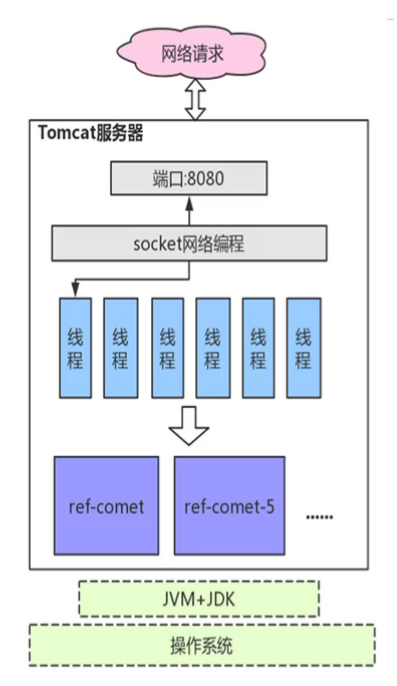
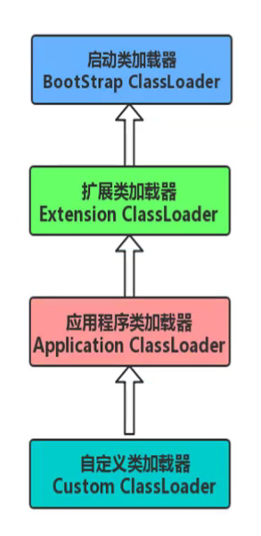
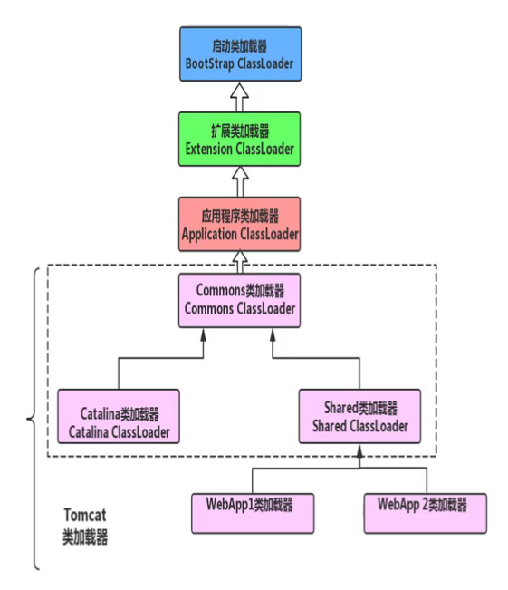

# Tomcat源码分析

## Tomcat 源码下载以及安装

### 1、源码下载地址：https://tomcat.apache.org/download-80.cgi

### 2、解压、新建 catalina-home 目录，同时将目录中的 conf 和 webapps 文件夹复制到 catalina-home 目录中

### 3、需要通过Maven组织文件，因此需要在根目录下创建目录中新建pom.xml文件
    
```xml
<?xml version="1.0" encoding="UTF-8"?>
<project xmlns="http://maven.apache.org/POM/4.0.0"
         xmlns:xsi="http://www.w3.org/2001/XMLSchema-instance"
         xsi:schemaLocation="http://maven.apache.org/POM/4.0.0 http://maven.apache.org/xsd/maven-4.0.0.xsd">
 
    <modelVersion>4.0.0</modelVersion>
    <groupId>org.apache.tomcat</groupId>
    <artifactId>Tomcat8.5</artifactId>
    <name>Tomcat8.5</name>
    <version>8.5</version>
 
    <build>
        <finalName>Tomcat8.5</finalName>
        <sourceDirectory>java</sourceDirectory>
        <testSourceDirectory>test</testSourceDirectory>
        <resources>
            <resource>
                <directory>java</directory>
            </resource>
        </resources>
        <testResources>
           <testResource>
                <directory>test</directory>
           </testResource>
        </testResources>
        <plugins>
            <plugin>
                <groupId>org.apache.maven.plugins</groupId>
                <artifactId>maven-compiler-plugin</artifactId>
                <version>2.3</version>
                <configuration>
                    <encoding>UTF-8</encoding>
                    <source>1.8</source>
                    <target>1.8</target>
                </configuration>
            </plugin>
        </plugins>
    </build>
 
    <dependencies>
        <dependency>
            <groupId>junit</groupId>
            <artifactId>junit</artifactId>
            <version>4.12</version>
            <scope>test</scope>
        </dependency>
        <dependency>
            <groupId>org.easymock</groupId>
            <artifactId>easymock</artifactId>
            <version>3.4</version>
        </dependency>
        <dependency>
            <groupId>ant</groupId>
            <artifactId>ant</artifactId>
            <version>1.7.0</version>
        </dependency>
        <dependency>
            <groupId>wsdl4j</groupId>
            <artifactId>wsdl4j</artifactId>
            <version>1.6.2</version>
        </dependency>
        <dependency>
            <groupId>javax.xml</groupId>
            <artifactId>jaxrpc</artifactId>
            <version>1.1</version>
        </dependency>
        <dependency>
            <groupId>org.eclipse.jdt.core.compiler</groupId>
            <artifactId>ecj</artifactId>
            <version>4.5.1</version>
        </dependency>
       
    </dependencies>
</project>
```
    
### 4、配置IDEA运行项目

- 通过pom.xml文件构建一个新的工程
- 如果编译build的时候出现Test测试代码报错，注释该代码即可。Tomcat源码util.TestCookieFilter类会报错，将其注释即可
- Tomcat启动的目录为一个main方法类：org.apache.catalina.startup.Bootstrap
- 添加VM options(如下)
- 运行项目，访问http://localhost:8080，得到结果可能是无法解析 JSP，需要添加 JSP 的解析器
- 修改完后，项目再启动，在浏览器访问 http://localhost:8080/，就可以看到我们所熟悉的经典欢迎页面了

```text
# jsp 解析器
-Dcatalina.home=catalina-home
-Dcatalina.base=catalina-home
-Djava.endorsed.dirs=catalina-home/endorsed
-Djava.io.tmpdir=catalina-home/temp
-Djava.util.logging.manager=org.apache.juli.ClassLoaderLogManager
-Djava.util.logging.config.file=catalina-home/conf/logging.properties
```

```java
// 添加 jsp 解析器
// 在 tomcat 的源码 org.apache.catalina.startup.ContextConfig 中的 configureStart 函数中手动将 JSP 解析器初始化：
// 添加代码(添加到 webConfig(); 这一句之后即可)

/**
 * Startup event listener for a <b>Context</b> that configures the properties
 * of that Context, and the associated defined servlets.
 *
 * @author Craig R. McClanahan
 */
public class ContextConfig implements LifecycleListener {
    /**
     * Process a "contextConfig" event for this Context.
     */
    protected synchronized void configureStart() {
        //..........
    
        webConfig(); 
    
        // 添加 jsp 解析器
        context.addServletContainerInitializer(new JasperInitializer(), null);
        // .........
    }
}
```

## Tomcat 启动流程分析


### 组件的生命周期管理

各组件用 Lifecycle 管理启动、停止、关闭操作

- Lifecycle 接口预览
- 几个核心方法
- Server 中的 init 方法示例
- 为啥 StandardServer 没有 init 方法
- LifecycleBase 中的 init 与 initInternal 方法
- 为什么这么设计？

### 分析 tomcat 请求过程

连接器 connector 与容器 container

- 为了解耦

connector 设计

- 监听服务端口，读取来自客户端的请求
- 将请求数据按照指定协议进行解析
- 根据请求地址匹配正确的容器进行处理
- 将相应返回给客户端

container 设计

- Servlet容器的实现

Servlet的请求和相应如何在容器中流转呢？


### 管道模式

管道与阀门

    管道就像一条管道把多个对象连接起来，整体看起来就像若干个阀门潜逃在管道中，而处理逻辑放在阀门上

    手写一个管道模式实现
    


- StandardEngine 容器初始化的东西(server.xml)
- StandardEngineValve 一个请求过来，这里封装需要处理的东西

    Tomcat 里自定义了一些比较重要的阀门类


## Tomcat 的挑战

部署多个项目(server.xml中host里增加多个context)



- Tomcat 上可以部署多个项目
- Tomcat 运行时需要加载哪些累
- Tomcat 中的多个项目可能存在相同的类
- Tomcat 中类加载的挑战
- 源码分析彻底弄懂 Tomcat 的类加载

## 类加载与类加载器

### 类加载

什么是类加载？

    主要将 class 文件中的二进制字节读入 JVM
    网络加载、内存(redis)

类加载的过程

    1、通过类名(全限定名，如xxx.ooo.Demo.class)读取这个类的二进制字节流
    2、将字节流所代表的静态结构转换成方法区中的运行时数据结构
    3、在内存中生成一个这个类的 java.lang.Class 对象，作为方法区的这个类的访问入口

### 类加载器

定义

    实现类加载过程的
    
类加载器

- 启动类加载器：该加载器使用 C++ 语言实现，属于虚拟机自身的一部分
- 拓展类加载器：
- 应用程序类加载器

- 其他类加载器：Java语言实现，独立于 JVM 外部，并且全部继承抽象 java.lang.ClassLoader
- 双亲委派模型：如果一个类加载器收到了请求，它首先不会自己去尝试加载这个类，而是把这个请求委派给父类加载器去完成，每一层都是如此，因此所有类加载的请求都会传到启动类加载器，只有当父加载器无完成请求时，子加载器才去自己加载。

- JDK 提供的核心类加载器
- 双亲委派模型在源码中的实现




Tomcat类加载的考虑

- 隔离性(不同的 WebApp 肯定由不懂的类加载器去加载)
- 灵活性(一个项目下的内容修改了，需要重新加载，不影响另外一个应用)
- 性能(JVM中 jar 包 class 很多，尽可能少加载不必要的 class)

Tomcat中的类加载器



- Common类加载器，Catalina类加载器，Shared类加载器
- WebApp类加载器
- WebApp类加载器打破双亲委派模型

源码分析

- Common类加载器，Catalina类加载器，Shared类加载器
- 尽早设置上下文类加载器
- WebApp类加载器
- Tomcat 中检测文件变动的原理

类的“唯一性”